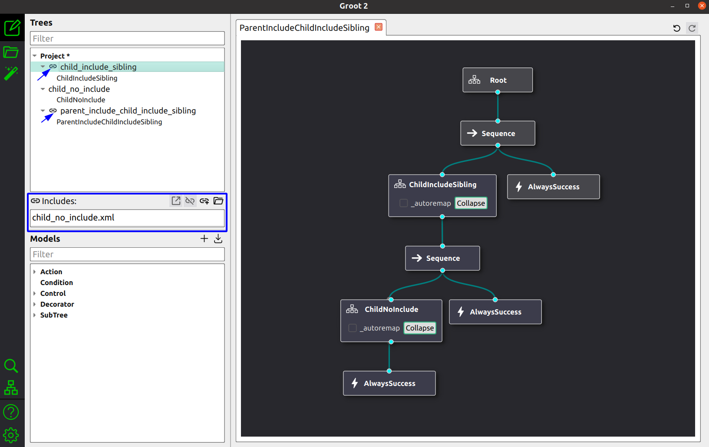
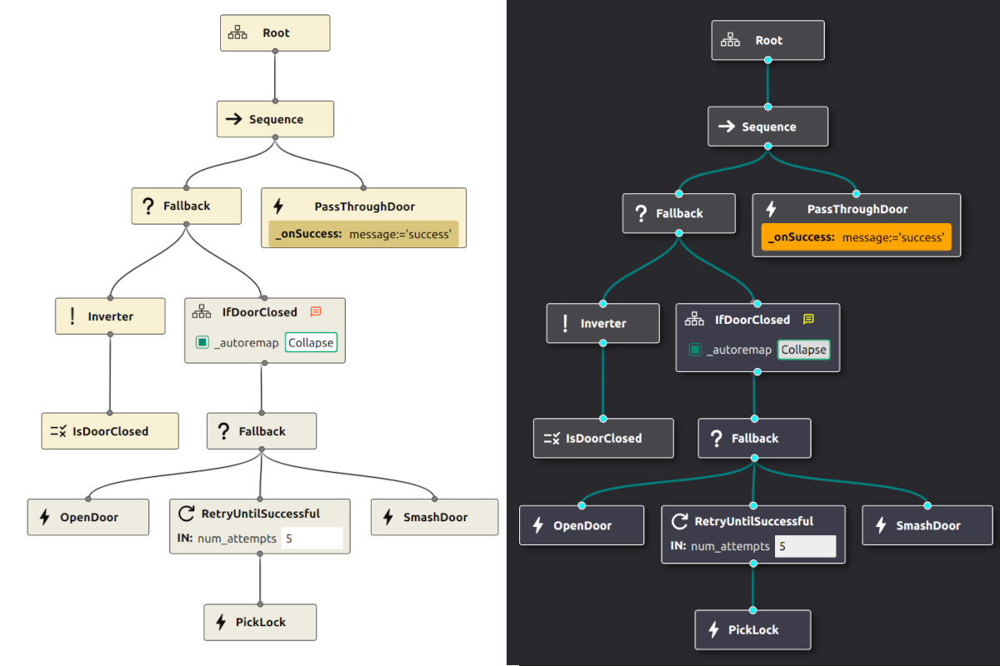

I am pleased to announce the release of the 4th Beta of Groot2. 
These are the most notable new features...

## Support for `<include>`

In **BehaviorTree.CPP** it is common to use the XML tag `<include>`
to automatically define the dependency between multiple XML.
This is not considered best practice anymore, and you are invited to follow the
best practices described in **Tutorial  7**. 

Nevertheless, some user may still rely on the former approach and we want to support them.
Now, when selecting a file in the top left Project widget, the **Includes** section
will appear below it. This can be used to inspect, remove and add includes.

 

# Theme and Style improvements

A lot of work went into implementing a more reliable and consistent style across platforms.
Additionally, the central NodeView area now supports both classic **Dark** theme and the new **Light** one. 

You can change the theme opening the **Preferences** dialog, by clicking on the gear icon at the bottom of the left sidebar.

