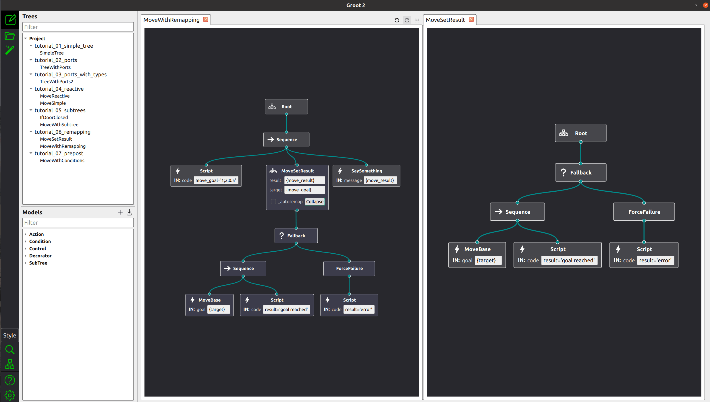

Less than 2 weeks after Beta 4, we have a new release!
This version includes some important bug fixes and also
some cool new features.

## Split View

See two Trees simultaneously, side by side.

Once the split view is opened (top-right icon), you
can drag and drop your trees from the Project View
to open it in a new tab, or move your tabs from one area to the other.

 

## Live XML preview

Ability to see a preview of the XML that will be generated, before you actually save the file.

The preview is updated live, if the Tree is modified.

 

## Save the current Tree view on file 

If you righ click on the Tree View area, you will see
a new option, **"Save Image"**.

You can choose to save the Tree View as PNG, JPEG or SVG.