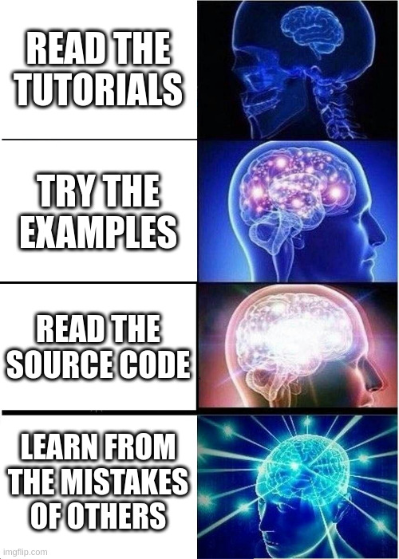

# Common Mistakes

Let's take a look at some common mistakes.



### Misuse of Sequence

A `Sequence` with just one child does not make sense. Here, the `IfThenElse` does not need to be wrapped in a `Sequence`.

```bash
<Sequence>
    <IfThenElse>
      ...
    </IfThenElse>
  </Sequence>
```

Nested `Sequences` also don't make sense. The nested `Sequence` can be removed.

```bash
<Sequence> 
  <Action ID="DoThing1"/>
  <Action ID="DoThing2"/>
  <!-- This sequence adds nothing -->
  <Sequence> 
    ... 
  </Sequence>
</Sequence>
```

### Fallback or Sequence Ending with AlwaysSuccess or AlwaysFailure

`AlwaysSuccess` or `AlwaysFailure` at the end of a `Sequence` is a red flag.

```bash
<Sequence> 
  <Action ID="DoThing1"/>
  <AlwaysFailure/>
</Sequence>
```

simplifies to...

```bash
<ForceFailure> 
  <Action ID="DoThing1"/>
</ForceFailure>
```

Likwise for `Fallback`:

```bash
<Fallback> 
  <Action ID="DoThing1"/>
  <AlwaysFailure/>
</Fallback>
```

simplifies to...

```bash
<Action ID="DoThing1"/>
```
