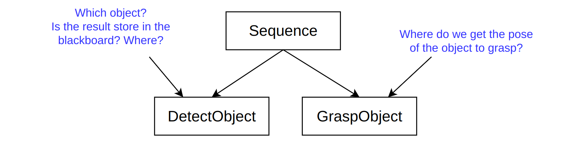
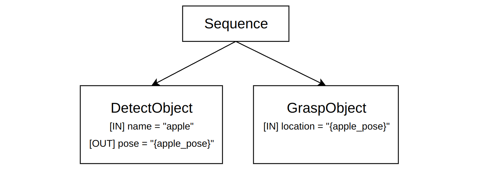

# Ports VS Blackboard

**BT.CPP** is the only implementation (to our knowledge) of Behavior Tree that
introduces the concept of **Input/Output Ports**, as an alternative to **Blackboards**.

To be more specific, Ports are an interface that adds a level of
indirection and additional semantics to the blackboard.

To understand why using Ports is recommended and using directly the Blackboard 
is **discouraged**, we should first understand some of the core principles 
of BehaviorTree.CPP.

## Goals of BT.CPP

### Model Driven Development

It is not the purpose of this article to explain what Model Driven Development is.
But, in short, we want to build a "model" of our Nodes, i.e. some kind of meta-information
that tells us how the Node interacts with  the rest of the tree.

Models are important both for developers (being self-documenting) and 
for external tools, such as visual editors, being Groot2 a notable example, 
or static analyzers.

We believe that the **description of the data-flow between Nodes must be part of the model**. 
Additionally, we want to clearly express if a blackboard entry is being written (output), 
read (input) or both. 

Consider this example:



In other implementations (or if anybody uses this library inappropriately...) the
only way to know if these two Nodes communicate and depend on each other is either:

- **inspecting the code**: something that we want to avoid.
- or **reading the documentation**: but documentation is not guaranteed to be accurate and up to date.

Instead, if Input/Output ports are part of the model, the intent of the Node and it
relationship with the others become more explicit:



### Nodes composibility and Subtree scoping

Ideally, we want to offer a platform that allows Behavior Designers to build trees
(i.e., "compose Nodes") implemented by different vendors / users.

But when the Blackboard is used directly, name-collision will become immediately an issue.

Think about common names such as `goal`, `results`, `target`, `value`, etc.

For instance, the Nodes **GraspObject** and **MoveBase** may be developed by different people
and they both read the entry `target` from the blackboard.
Unfortunately, they have different meanings and the type itself is different: 
the former expects a 3D pose, whilst the latter a 2D one.

**Ports** offer one level of indirection, called also "remapping", as explained in
[Tutorial 2](../tutorial-basics/tutorial_02_basic_ports.md).

This means that, no matter which name is used when defining the Port 
(that name is "hardcoded" into your C++ implementation),
you can always "remap" it to a different blackboard entry into your XML, 
without modifying the source code.

The same is true for Subtrees remapping, explained in [Tutorial 6](../tutorial-basics/tutorial_06_subtree_ports.md). 
Being the Blackboard a glorified map of global variables, it scales very poorly. 
There is a reason why global variables are a no-no in programming!

Ports remapping offers a solution to this problem.


## Summary: never use the Blackboard directly

You should do this:

```c++
// example code in your tick()
getInput("goal", goal);
setOutput("result", result);
```

and avoid as much as possible this:

```c++
// example code in your tick()
config().blackboard->get("goal", goal);
config().blackboard->set("result", result);
```

Both these codes may technically work, but the latter (direct access to the blackboard) 
is considered bad practice and **it is highly discouraged**:

The problems with the 2nd version, i.e. the direct access to the blackboard:

1. Names "goal" and "result" are hard-coded. To change them, you must recompile your application. Port, instead, can be remapped at run-time, modifying only the XML.

2. The only way to know if a Node reads or writes one or more entries of the blackboard, 
is by inspecting the code. Up to date documentation is a solution, but the Port model is self-documenting.

3. The `BehaviorTreeFactory` is unaware that those blackboard entries are being accessed.
In contrast, when using Ports, we are able to introspect how ports communicate to each other
and also to check at deployment time if the connection is done correctly.

4. It may not work as expected when using SubTrees.

5. The template specialization `convertFromString()` will not work correctly.


