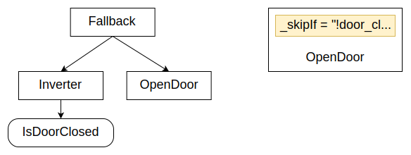

# Pre and Post conditions

Leveraging the power of the scripting language
introduced in the [previous tutorial](guides/scripting.md),
BT.CPP 4.x introduces the concept of Pre and Post Conditions,
i.e scripts that can run either before or after the actual 
__tick()__ of a Node.

Pre and Post conditions are supported by __all__ the nodes and
 don't need any modifications in your C++ code.

:::caution
The goal of scripting is __not__ to write complex code,
but only to improve the readability of the tree and 
reduce the need for custom C++ Nodes in very simple 
use cases.

If your scripts become too long, you may want to 
reconsider your decision to use them.
:::

## Pre conditions

| Name | Description | When Evaluated |
|-------------|---------|----------------|
| **_skipIf**    |  Skip the execution of this Node, if the condition is true   | IDLE only (once) |
| **_failureIf** |  Skip and return FAILURE, if the condition is true | IDLE only (once) |
| **_successIf** |  Skip and return SUCCESS, if the condition is true | IDLE only (once) |
| **_while**     |  If false when IDLE, skip. If false when RUNNING, halt the node and return SKIPPED. | IDLE and RUNNING (every tick) |

:::caution Important: One-time vs. Continuous Evaluation
**`_skipIf`, `_failureIf`, and `_successIf` are evaluated only once** when the node
transitions from IDLE to another state. They are **NOT re-evaluated** while the node
is RUNNING.

Only **`_while`** is checked on every tick, including while the node is running.

If you need a condition to be re-evaluated on every tick, use the `<Precondition>`
decorator node with `else="RUNNING"` instead of these attributes.
:::

:::note Evaluation Order
Pre conditions are evaluated in this order: `_failureIf` -> `_successIf` -> `_skipIf` -> `_while`.
The first condition that is satisfied will determine the result.
:::

### Example

In previous tutorials, we saw how to build an if-then-else
logic in the tree using a fallback.

The new syntax is much more compact:



Previous approach:

``` xml
<Fallback>
    <Inverter>
        <IsDoorClosed/>
    </Inverter>
    <OpenDoor/>
</Fallback>
```

If, instead of using a custom ConditionNode __IsDoorOpen__,
we can store a boolean in an entry called `door_closed`, the XML can be rewritten as:

``` xml
<OpenDoor _skipIf="!door_closed"/>
```

### Using `<Precondition>` for Per-Tick Evaluation

When you need a condition to be checked on **every tick** (not just when the node starts),
use the `<Precondition>` decorator node instead of inline attributes.

This is particularly useful in **ReactiveSequence** or **ReactiveFallback** where you want
the condition to be re-evaluated each time the running child is ticked:

``` xml
<!-- This checks the condition on every tick -->
<Precondition if="battery_ok" else="RUNNING">
    <MoveToGoal/>
</Precondition>
```

With `else="RUNNING"`, if the condition becomes false while the child is running,
the decorator returns RUNNING (keeping the tree alive) instead of immediately
returning FAILURE or SKIPPED.

Compare this to the inline attribute:

``` xml
<!-- This checks the condition ONLY when MoveToGoal starts -->
<MoveToGoal _successIf="battery_ok"/>
```

The inline `_successIf` is evaluated once when `MoveToGoal` transitions from IDLE.
If `battery_ok` changes while `MoveToGoal` is RUNNING, the change is ignored.

## Post conditions

| Name | Description |
|-------------|---------|
| **_onSuccess** | Execute this script, if the Node returned SUCCESS |
| **_onFailure** | Execute this script, if the Node returned FAILURE  |
| **_post**      | Execute this script, if the Node returned either SUCCESS or FAILURE |
| **_onHalted**  | Script executed if a RUNNING Node was halted |


### Example

In a [tutorial about subtrees](tutorial-basics/tutorial_06_subtree_ports.md),
 we saw how a specific blackboard variable was written based on the result
 of __MoveBase__. 

On the left side, you can see how this logic would be
implemented in BT.CPP 3.x and how much simpler it is to use post conditions instead.
Additionally, the new syntax supports **enums**.


Previous version:

``` xml
<Fallback>
    <Sequence>
        <MoveBase  goal="{target}"/>
        <SetBlackboard output_key="result" value="0" />
    </Sequence>
    <ForceFailure>
        <SetBlackboard output_key="result" value="-1" />
    </ForceFailure>
</Fallback>
```

New implementation:

``` xml
<MoveBase goal="{target}" 
          _onSuccess="result:=OK"
          _onFailure="result:=ERROR"/>
```

# Design pattern: error codes

One of the areas where Behavior Trees may struggle, when 
compared to State Machines, is in those patterns where
a different strategy should be executed based on the 
result of an Action. 

Since BTs are limited to SUCCESS and FAILURE, that could 
be unintuitive.

A solution is storing the __result / error code__ in the
blackboard, but that was cumbersome in version 3.X.

Pre conditions can help us implement more readable code, like this one:


In the tree above, we added an Output port __return__ to
__MoveBase__ and we conditionally take the second or third branch
of the Sequence based on the value of `error_code`.

# Design pattern: states and declarative trees

Even if the promise of Behavior Tree is to free us from 
the tyranny of states, but the truth is that sometimes it is
hard to reason about our application without states.

Using states can make our Tree easier. For instance, we can 
take a certain branch of the tree only when the robot
(or a subsystem) is in a particular state.

Consider this Node and its pre/post conditions:


This node will be executed only if the state is equal to **DO_LANDING** and, once the value of `altitude` is small
enough, the state is changed to **LANDED**.

Note as DO_LANDING and LANDED are enums, not strings

:::tip
A surprising side effect of this pattern is that we made our
Node more __declarative__ i.e. it is easier to move this specific Node/Subtree into a different portion of the tree.
:::
