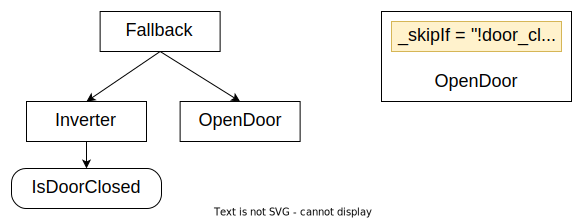
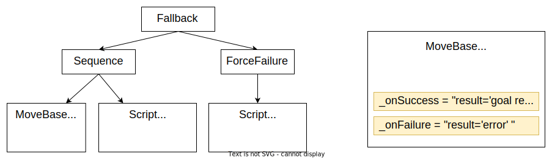
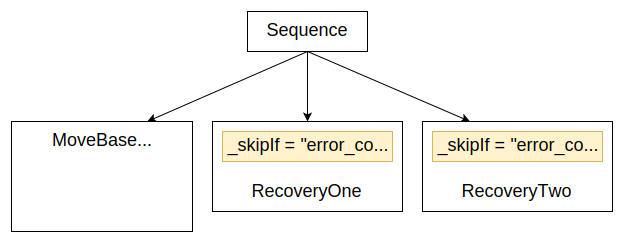
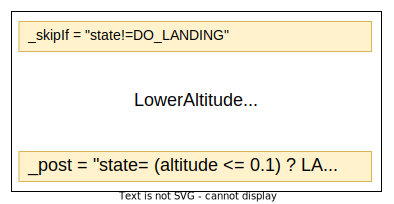

# Pre and Post conditions

Leveraging the power of the scripting language
introduced in the [previous tutorial](tutorial-advanced/scripting.md),
BT.CPP 4.x introcude the concept of Pre and Post Conditions,
i.e script that can run either before or after the actual 
__tick()__ of a Node.

Pre and Post condition are supported by __all__ the nodes and
 don't need any modifications in your C++ code.

:::caution
The goal of scripting is __not__ to write complex code,
but only to improve the readability of the tree and 
reduce the need for custom C++ Nodes in very simple 
use cases.

If your scripts become too long, you may want to 
reconsider your decision of using them.
:::

## Pre conditions

| Name | Description |
|-------------|---------|
| **_skipIf**    |  Skip the execution of this Node, if the condition is true   |
| **_failureIf** |  Skip and return FAILURE, if the condition os true |
| **_successIf** |  Skip and return SUCCESS, if the condition os true |
| **_while**     |  Same as _skipIf, but mau also interrupt a RUNNING Node if  the condition becomes false. |

### Example

In a previous tutorials we saw how to build an if-then-else
logic in the tree using a fallback.

The new syntax is much more compact:



Previous approach:

``` xml
<Fallback>
    <Inverter>
        <IsDoorClosed/>
    </Inverter>
    <OpenDoor/>
</Fallback>
```

If, instead of using a custom ConditionNode __IsDoorOpen__,
we can store a boolean in an entry called `door_closed`, the XML can be rewritten as:

``` xml
<OpenDoor _skipIf="!door_closed"/>
```

## Post conditions

| Name | Description |
|-------------|---------|
| **_onSuccess** | Execute this script, if the Node returned SUCCESS |
| **_onFailure** | Execute this script, if the Node returned FAILURE  |
| **_onHalted**  | Sctipt execute if a RUNNING Node was halted |
| **_while**     | Script executed if Node returns either SUCCESS or FAILURE |

### Example

In a [tutorial about subtrees](tutorial-basics/tutorial_06_subtree_ports.md),
 we saw how a specific blackboard variable was written based on the result
 of __MoveBase__. 

On the left side, you can see how this logic would be
implemented in BT.CPP 3.x and how much simpler it is to use post conditions instead.
Additionally, the new syntax supports **enums**.



Previous version:

``` xml
<Fallback>
    <Sequence>
        <MoveBase  goal="{target}"/>
        <SetBlackboard output_key="result" value="0" />
    </Sequence>
    <ForceFailure>
        <SetBlackboard output_key="result" value="-1" />
    </ForceFailure>
</Fallback>
```

New implementation:

``` xml
<MoveBase goal="{target}" 
          _onSuccess="result:=OK"
          _onFailure="result:=ERROR"/>
```

# Design pattern: error codes

One of the areas where Behavior Trees may struggle, when 
compared to State Machines, is in those patterns where
a diferent strategy should be executed based on the 
result of an Action. 

Since BTs are limited to SUCCESS and FAILURE, that could 
be unintuitive.

A solution is to store the __result / error code__ in the
blackboard, but that was cumbersome in version 3.X.

Pre conditions can help us implementing code that is more
readable, like this one:



In the tree above, we added an Output port __return__ to
__MoveBase__ and we conditionally take the second or third branch
of the Sequence based on the value of `error_code`.

# Design pattern: states and declarrative trees

Even if the promise of Behavior Tree is to free us from 
the tiranny of states, but the truth is that sometimes it is
hard to reason about our application without states.

Using states can make our Tree easier. For instance we can 
take a certain branch of the tree only when the robot
(or a subsystem) is in a particular state.

Consider this Node and its pre/post conditions:



This node will be executed only if state is equal to **DO_LANDING** and, once the value of `altitude` is small
enough, the stated is changed to **LANDED**.

Note as DO_LANDING and LANDED are enums, not strings

:::tip
A surprising side effect of this patterns is that we made our
Node more __declarative__ i.e. it is easier to move this specific Node/Subtree into a different portion of the tree.
:::
