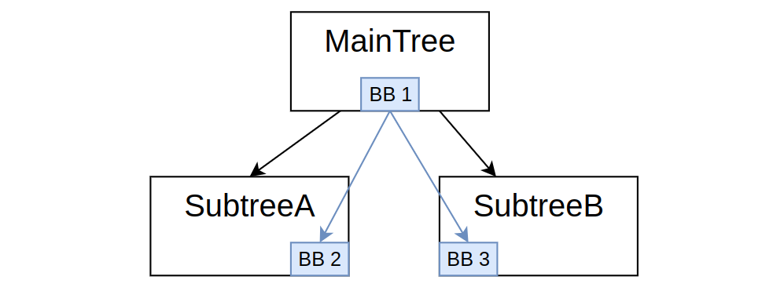

# Why a "global blackboard" 

:::note
Introduced in Bt.CPP 4.6.0
:::

As described in earlier tutorials, BT.CPP insists on the importance of having "scoped blackboards", to
isolate each subtree as they were independent functions / routines, in a programming language.

Still, there are cases where it could be desirable to have a truly "global" blackboard, that can be 
accessed from every Subtree directly, without remapping.

This may make sense for:

- Singletons and global objects that can't be shared as described in [Tutorial 8](tutorial-basics/tutorial_08_additional_args.md)
- Global states of the robot. 
- Data that is written / read outside the Behavior Tree, i.e. in the main loop executing the tick.

Additionally, since the blackboard is a generic key/value storage, where the value can have **any** type,
it is a perfect data structure to implement what is known in the literature as "World Model",
i.e. data that represents the state of the world, and that the Nodes in the tree may need to access.


Consider a simple Tree with two subtrees, like this:



Each one of the 3 Subtree has its own blackboard; the parent.child relationship between these
blackboards is exactly the same as the BehaviorTrees, i.e. BB1 is the parent of BB2 and BB3.

The lifecycle of these individual blackboards is coupled with their respective Subtree.

We will can introduce easily an external "global blackboard" like this:

```cpp
auto global_bb = BT::Blackboard::create();
auto maintree_bb = BT::Blackboard::create(global_bb);
auto tree = factory.createTree("MainTree", maintree_bb);
```

This will create the following hierarchy, among blackboards:


The instance `global_bb` lives "outside" the behavior tree and will persist if the 
object `tree` is destroyed.

Furthermore, it can be easily accessed using `set` and `get` methods.

## How to access the top-level blackboard from the tree

We call a blackboard the "top-level" one, when it is the root or the hierarchy.

In the previous tutorials, that would be the one inside "MainTree", but when the code above 
is used, `global_bb` will become the top-level one.

Since version **4.6** of BT.CPP, a new syntax was introduced to access the top-level
blackboard **without remapping**.

Simply, add the prefix "@" to the name of the entry. For instance:


```xml
<PrintNumber val="{@value}" />
```

This code will always search the entry `value` in the top-level blackboard, instead of the local one.

## Full example

Consider this tree:

```xml
  <BehaviorTree ID="MainTree">
    <Sequence>
      <PrintNumber name="main_print" val="{@value}" />
      <SubTree ID="MySub"/>
    </Sequence>
  </BehaviorTree>

  <BehaviorTree ID="MySub">
    <Sequence>
      <PrintNumber name="sub_print" val="{@value}" />
      <Script code="@value_sqr := @value * @value" />
    </Sequence>
  </BehaviorTree>
```

And the C++ code:

```cpp
class PrintNumber : public BT::SyncActionNode
{
public:
  PrintNumber(const std::string& name, const BT::NodeConfig& config)
    : BT::SyncActionNode(name, config)
  {}

  NodeStatus tick() override
  {
    const int val = getInput<int>("val").value();
    std::cout << "[" << name() << "] val: " << val << std::endl;
    return NodeStatus::SUCCESS;
  }

  static BT::PortsList providedPorts()
  {
    return { BT::InputPort<int>("val") };
  }
};

int main()
{
  BehaviorTreeFactory factory;
  factory.registerNodeType<PrintNumber>("PrintNumber");
  factory.registerBehaviorTreeFromText(xml_main);

  // No one will take the ownership of this blackboard
  auto global_bb = BT::Blackboard::create();
  // "MainTree" will own maintree_bb
  auto maintree_bb = BT::Blackboard::create(global_bb);
  auto tree = factory.createTree("MainTree", maintree_bb);

  // we can interact directly with global_bb
  for(int i = 1; i <= 3; i++)
  {
    // write the entry "value"
    global_bb->set("value", i);
    // tick the tree
    tree.tickOnce();
    // read the entry "value_sqr"
    auto value_sqr = global_bb->get<int>("value_sqr");
    // print 
    std::cout << "[While loop] value: " << i 
              << " value_sqr: " << value_sqr << "\n\n";
  }
  return 0;
}
```

Output:
```
[main_print] val: 1
[sub_print] val: 1
[While loop] value: 1 value_sqr: 1

[main_print] val: 2
[sub_print] val: 2
[While loop] value: 2 value_sqr: 4

[main_print] val: 3
[sub_print] val: 3
[While loop] value: 3 value_sqr: 9
```

Notes:

- The prefix "@" works both when used in an InputPort or in the scripting language.
- No remapping is needed in the Subtrees.
- When accessing the blackboard directly in the main loop, no prefix "@" is needed.