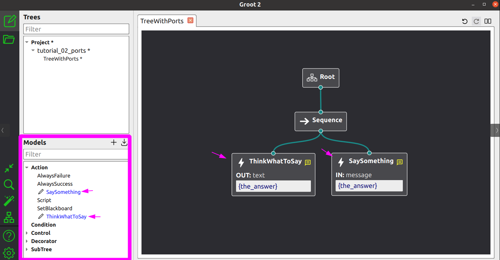

**Groot2** is the official IDE to Edit, Monitor and interact with
a Behavior Tree created with **BT.CPP**.

Integrating the two is very easy, as you will see in this tutorial,
but there are some simple concepts that you should understand first.

## The TreeNodesModel

Groot requires a "TreeNode model".



For instance, in the image above, Groot needs to know that the user-defined nodes
`ThinkWhatToSay` and `SaySomething` exist.

Additionally, it requires:

- The Node type
- Name and type (input/output) of ports.

These models are expressed in XML. In this case, they would be:

```xml
  <TreeNodesModel>
    <Action ID="SaySomething">
      <input_port name="message"/>
    </Action>
    <Action ID="ThinkWhatToSay">
      <output_port name="text"/>
    </Action>
  </TreeNodesModel>
```

Nevertheless, **you should not create these
XML descriptions by hand**.

BT.CPP has a specific function that, will
generate this XML for you, after the
Node types were registered into the factory.

```cpp
  BT::BehaviorTreeFactory factory;
  // register here your user-defined Nodes
  // ...
  std::string xml_models = BT::writeTreeNodesModelXML(factory);

  // this xml_models should be saved to file and 
  // loaded in Groot2
```

## Adding real-time visualization to Groot

:::note
Currently, only the PRO version of Groot2 supports real-time visualization.
:::

Connecting a tree to Groot2 requires a single line of code:

```cpp
BT::Groot2Publisher publisher(tree);
```

This will create an inter-process communication service
between your BT.CPP executor and Groot2 that:

- Sends the entire tree structure to Groot2, including the Models mentioned above.
- Periodically updates the status of the individual Nodes (RUNNING, SUCCESS, FAILURE, IDLE).
- Sends the value of the blackboard(s); basic types such as integers, reals and strings are supported out of the box, others need to be added manually.
- Allows Groot2 to insert breakpoints, perform a Node substitution or fault injection.

Full example:

```xml
<root BTCPP_format="4">

  <BehaviorTree ID="MainTree">
    <Sequence>
      <Script code="door_open:=false" />
      <Fallback>
        <Inverter>
          <IsDoorClosed/>
        </Inverter>
        <SubTree ID="DoorClosed" _autoremap="true" door_open="{door_open}"/>
      </Fallback>
      <PassThroughDoor/>
    </Sequence>
  </BehaviorTree>

  <BehaviorTree ID="DoorClosed">
    <Fallback name="tryOpen" _onSuccess="door_open:=true">
      <OpenDoor/>
        <RetryUntilSuccessful num_attempts="5">
          <PickLock/>
        </RetryUntilSuccessful>
      <SmashDoor/>
    </Fallback>
  </BehaviorTree>

</root>
```

```cpp
int main()
{
  BT::BehaviorTreeFactory factory;

  // Our set of simple Nodes, related to CrossDoor
  CrossDoor cross_door;
  cross_door.registerNodes(factory);

  // Groot2 editor requires a model of your registered Nodes.
  // You don't need to write that by hand, it can be automatically
  // generated using the following command.
  std::string xml_models = BT::writeTreeNodesModelXML(factory);

  factory.registerBehaviorTreeFromText(xml_text);
  auto tree = factory.createTree("MainTree");

  // Connect the Groot2Publisher. This will allow Groot2 to
  // get the tree and poll status updates.
  BT::Groot2Publisher publisher(tree);

  // we want to run this indefinitely
  while(1)
  {
    std::cout << "Start" << std::endl;
    cross_door.reset();
    tree.tickWhileRunning();
    std::this_thread::sleep_for(std::chrono::milliseconds(3000));
  }
  return 0;
}
```

## Visualize custom types in the Blackboard

The content inside the blackboard is sent to Groot2 using a JSON format.

To add a new type, and allow Groot2 to visualize them, you should 
follow the instructions here:

https://json.nlohmann.me/features/arbitrary_types/

For instance, given a user-defined type:

```c++
struct Pose2D {
    double x;
    double y;
    double theta;
}
```

The following function should be implemented:

```c++
void to_json(nlohmann::json& dest, const Pose2D& pose) {
    dest["x"] = pose.x;
    dest["y"] = pose.y;
    dest["theta"] = pose.theta;
}
```