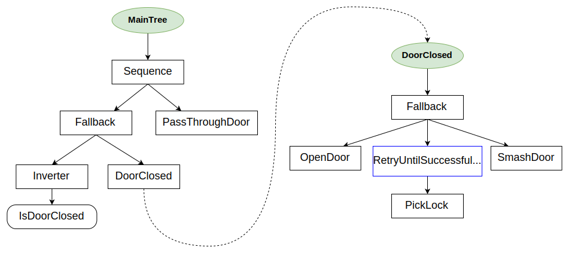

# Compose behaviors using Subtrees 

We can build large-scale behavior by inserting smaller and reusable
behaviors into larger ones.

In other words, we want to create __hierarchical__ behavior trees and make 
our trees __composable__. 

This can be achieved by defining multiple trees in the XML and using the
node __SubTree__ to include one tree into the other.

# CrossDoor behavior

This example is inspired by a popular 
[article about behavior trees](http://www.gamasutra.com/blogs/ChrisSimpson/20140717/221339/Behavior_trees_for_AI_How_they_work.php).

It is also the first practical example that uses `Decorators` and `Fallback`.



``` xml
<root BTCPP_format="4">

    <BehaviorTree ID="MainTree">
        <Sequence>
            <Fallback>
                <Inverter>
                    <IsDoorClosed/>
                </Inverter>
                // highlight-next-line
                <SubTree ID="DoorClosed"/>
            </Fallback>
            <PassThroughDoor/>
        </Sequence>
    </BehaviorTree>

    <BehaviorTree ID="DoorClosed">
        <Fallback>
            <OpenDoor/>
            <RetryUntilSuccessful num_attempts="5">
                <PickLock/>
            </RetryUntilSuccessful>
            <SmashDoor/>
        </Fallback>
    </BehaviorTree>
    
</root>
```

The desired behavior is:

- If the door is open, `PassThroughDoor`.
- If the door is closed, try `OpenDoor`, or 
try `PickLock` up to 5 times or, finally, `SmashDoor`.
- If at least one of the actions in the `DoorClosed` subtree succeeded,
then `PassThroughDoor`.


## The CPP code

We will not show the detailed implementation of the dummy actions
in `CrossDoor`.

The only interesting piece of code is probably `registerNodes`.

``` cpp

class CrossDoor
{
public:
    void registerNodes(BT::BehaviorTreeFactory& factory);

    // SUCCESS if _door_open == true
    BT::NodeStatus isDoorClosed();

    // SUCCESS if _door_open == true
    BT::NodeStatus passThroughDoor();

    // After 3 attempts, will open a locked door
    BT::NodeStatus pickLock();

    // FAILURE if door locked
    BT::NodeStatus openDoor();

    // WILL always open a door
    BT::NodeStatus smashDoor();

private:
    bool _door_open   = false;
    bool _door_locked = true;
    int _pick_attempts = 0;
};

// Helper method to make registering less painful for the user
void CrossDoor::registerNodes(BT::BehaviorTreeFactory &factory)
{
  factory.registerSimpleCondition(
      "IsDoorClosed", std::bind(&CrossDoor::isDoorClosed, this));

  factory.registerSimpleAction(
      "PassThroughDoor", std::bind(&CrossDoor::passThroughDoor, this));

  factory.registerSimpleAction(
      "OpenDoor", std::bind(&CrossDoor::openDoor, this));

  factory.registerSimpleAction(
      "PickLock", std::bind(&CrossDoor::pickLock, this));

  factory.registerSimpleCondition(
      "SmashDoor", std::bind(&CrossDoor::smashDoor, this));
}

int main()
{
  BehaviorTreeFactory factory;

  CrossDoor cross_door;
  cross_door.registerNodes(factory);

  // In this example a single XML contains multiple <BehaviorTree>
  // To determine which one is the "main one", we should first register
  // the XML and then allocate a specific tree, using its ID

  factory.registerBehaviorTreeFromText(xml_text);
  auto tree = factory.createTree("MainTree");

  // helper function to print the tree
  printTreeRecursively(tree.rootNode());

  tree.tickWhileRunning();

  return 0;
}

```


